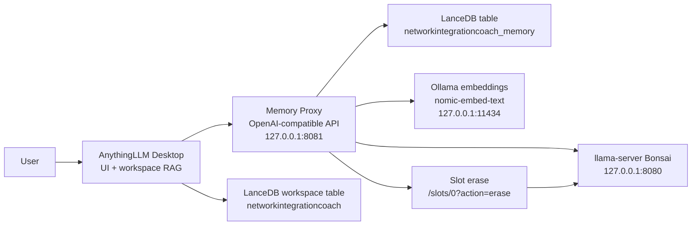

# NetworkIntegrationCoach Memory RAG

A Windows-first local AI stack for an Android phone-to-laptop networking coach.
It combines:

- AnythingLLM Desktop as the chat UI and coding/networking RAG workspace.
- LanceDB as both the normal dataset vector store and a separate semantic long-memory tank.
- Ollama for embeddings with `nomic-embed-text`.
- `llama-server` from llama.cpp for the Bonsai chat model.
- A small OpenAI-compatible memory proxy that keeps the model context lean.

The core idea is simple: keep the internal model context small, move durable memory into LanceDB, and still let AnythingLLM do normal RAG over the coding/networking dataset.

## What This Solves

Local LLMs have a hard context window. Even when a server has prompt caching or slot state, the live model still has to fit inside the active context. This repo implements a practical external memory pattern:

1. AnythingLLM builds the current prompt and retrieves normal workspace RAG context.
2. The memory proxy receives the OpenAI-compatible chat request.
3. The proxy embeds the latest user request and retrieves relevant prior memory from a separate LanceDB table.
4. The proxy keeps system messages, current RAG context, and the latest user message.
5. The proxy drops old raw user/assistant chat history before forwarding to Bonsai.
6. The proxy stores a compact memory record after the answer.
7. The proxy calls `POST /slots/0?action=erase` so Bonsai does not retain the turn internally.

This is not infinite KV-cache context. It is a semantic memory loop that gives the assistant continuity without dragging every old turn through the runtime prompt.

## Architecture



## Ports

| Service | URL | Purpose |
| --- | --- | --- |
| Ollama | `http://127.0.0.1:11434` | Embeddings and model management |
| Bonsai llama-server | `http://127.0.0.1:8080/v1` | Chat completion backend |
| Memory proxy | `http://127.0.0.1:8081/v1` | OpenAI-compatible memory middleware |
| AnythingLLM Desktop backend | `http://127.0.0.1:3001` | Local UI/backend |

## Repository Layout

```text
.
|-- src/
|   `-- memory_proxy.py
|-- scripts/
|   |-- NetworkIntegrationCoachLauncher.ps1
|   |-- configure_anythingllm_env.ps1
|   |-- pull_models.ps1
|   |-- start_bonsai_llama_server.ps1
|   |-- start_memory_proxy.ps1
|   `-- verify_stack.ps1
|-- tools/
|   |-- generate_network_guide_dataset.py
|   |-- validate_dataset.py
|   |-- chunk_dataset_for_anythingllm.py
|   `-- embed_dataset_to_anythingllm.py
|-- examples/
|   `-- test_network_guide.jsonl
|-- docs/
`-- Launch NetworkIntegrationCoach.cmd
```

Generated datasets, embedding caches, logs, and slot state are intentionally ignored by git.

## Requirements

- Windows 11.
- Python 3.10 or newer.
- Git.
- Ollama Desktop or Ollama CLI.
- AnythingLLM Desktop.
- llama.cpp `llama-server.exe`.
- A GGUF chat model. The scripts default to Bonsai-8B from `hf.co/prism-ml/Bonsai-8B-gguf:Q1_0`.

Install Python dependencies:

```powershell
python -m pip install -r requirements.txt
```

Install llama.cpp server with winget:

```powershell
winget install --id ggml.llamacpp --accept-source-agreements --accept-package-agreements
```

Pull the local models:

```powershell
powershell -NoProfile -ExecutionPolicy Bypass -File .\scripts\pull_models.ps1
```

## Quick Start

1. Configure AnythingLLM to call the proxy:

   ```powershell
   powershell -NoProfile -ExecutionPolicy Bypass -File .\scripts\configure_anythingllm_env.ps1
   ```

2. Launch the stack:

   ```powershell
   .\Launch NetworkIntegrationCoach.cmd
   ```

3. Click `Launch Network Coach`.

4. Verify the endpoints:

   ```powershell
   powershell -NoProfile -ExecutionPolicy Bypass -File .\scripts\verify_stack.ps1
   ```

5. Open AnythingLLM Desktop and use the `networkintegrationcoach` workspace.

## AnythingLLM Provider Settings

The important setting is the LLM base path:

```env
LLM_PROVIDER='generic-openai'
GENERIC_OPEN_AI_BASE_PATH='http://127.0.0.1:8081/v1'
GENERIC_OPEN_AI_MODEL_PREF='Bonsai-8B-gguf'
GENERIC_OPEN_AI_API_KEY='none'
EMBEDDING_ENGINE='ollama'
EMBEDDING_BASE_PATH='http://127.0.0.1:11434'
EMBEDDING_MODEL_PREF='nomic-embed-text:latest'
VECTOR_DB='lancedb'
```

AnythingLLM still owns the normal workspace RAG table. The proxy owns only the external memory table, `networkintegrationcoach_memory`.

## Memory Proxy API

The proxy intentionally implements only the endpoints AnythingLLM needs:

- `GET /health`
- `GET /memory/stats`
- `GET /v1/models`
- `POST /v1/chat/completions`

Example health check:

```powershell
Invoke-RestMethod http://127.0.0.1:8081/health | ConvertTo-Json -Depth 8
```

Example memory stats:

```powershell
Invoke-RestMethod http://127.0.0.1:8081/memory/stats | ConvertTo-Json -Depth 5
```

## Bonsai Runtime Settings

`scripts/start_bonsai_llama_server.ps1` starts llama-server with:

- `--ctx-size 8192`
- `-ngl 99`
- `--no-mmap`
- `--flash-attn on`
- `--parallel 1`
- `--cache-ram 0`
- `--slot-save-path .\slot_state`

The important memory behavior is:

- `--cache-ram 0` disables llama-server prompt cache.
- `--slot-save-path` enables `/slots/{id}?action=erase`.
- The proxy erases slot `0` after each response.

## Dataset Pipeline

The dataset tools are optional. They create and load a synthetic phone-to-laptop networking guide dataset into AnythingLLM's LanceDB storage.

Generate:

```powershell
python .\tools\generate_network_guide_dataset.py --records 2000000
```

Validate:

```powershell
python .\tools\validate_dataset.py
```

Embed into AnythingLLM:

```powershell
python .\tools\embed_dataset_to_anythingllm.py --reset
```

For a quick smoke test, use the fixture in `examples/test_network_guide.jsonl` instead of generating the full dataset.

## Verification Checklist

Run:

```powershell
powershell -NoProfile -ExecutionPolicy Bypass -File .\scripts\verify_stack.ps1
```

Expected results:

- Ollama responds on `11434`.
- Bonsai responds on `8080`.
- Memory proxy responds on `8081`.
- AnythingLLM responds on `3001`.
- Proxy health reports `online: true`.
- Bonsai logs include `prompt cache is disabled`.
- Proxy logs include `slot erase succeeded` after a chat request.

## Safety Notes

- Do not commit AnythingLLM's full `storage` folder.
- Do not commit generated datasets, embedding caches, logs, or slot-state files.
- Keep the memory table separate from the workspace table.
- Prefer private GitHub repositories if your memory store or generated dataset contains personal paths, device details, or local troubleshooting output.

## Documentation

- [Architecture](docs/architecture.md)
- [Windows setup](docs/setup-windows.md)
- [AnythingLLM configuration](docs/anythingllm-configuration.md)
- [Dataset pipeline](docs/dataset-pipeline.md)
- [Operations and troubleshooting](docs/operations.md)
- [Publishing to GitHub](docs/publishing.md)
